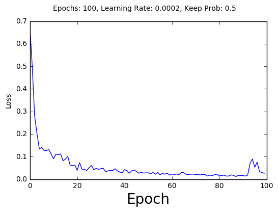

# Semantic Segmentation
### Introduction
In this project, you'll label the pixels of a road in images using a Fully Convolutional Network (FCN).

### Setup
##### Frameworks and Packages
Make sure you have the following is installed:
 - [Python 3](https://www.python.org/)
 - [TensorFlow](https://www.tensorflow.org/)
 - [NumPy](http://www.numpy.org/)
 - [SciPy](https://www.scipy.org/)
##### Dataset
Download the [Kitti Road dataset](http://www.cvlibs.net/datasets/kitti/eval_road.php) from [here](http://www.cvlibs.net/download.php?file=data_road.zip).  Extract the dataset in the `data` folder.  This will create the folder `data_road` with all the training a test images.

### Start
##### Implement
Implement the code in the `main.py` module indicated by the "TODO" comments.
The comments indicated with "OPTIONAL" tag are not required to complete.
##### Run
Run the following command to run the project:
```
python main.py
```
**Note** If running this in Jupyter Notebook system messages, such as those regarding test status, may appear in the terminal rather than the notebook.

### Submission
1. Ensure you've passed all the unit tests.
2. Ensure you pass all points on [the rubric](https://review.udacity.com/#!/rubrics/989/view).
3. Submit the following in a zip file.
 - `helper.py`
 - `main.py`
 - `project_tests.py`
 - Newest inference images from `runs` folder  (**all images from the most recent run**)

### Semantic Segmentation Steps

1. Load VGG
2. Create a fully convolution network from VGG by doing the following changes:
  a. Connecting vgg layer7 to a 1x1 convolution and then to a transposed convulational network with a 4x2 output
  b. Connecting vgg layer4 to a 1x1 convolution to serve as a skip layer along with the output from part a together into a transposed convolution network to give a 4x2 output
  c. connecting vgg layer3 to a 1x1 convolution to serve as a skip layer along with the output from part b together into a transposed convolution network to give a 16x8 output
  The output of c is the final output, where it will give an image of the size 16x8
3. Create a placeholder tensor to hold the learning_rate and another to hold correct_label with dimensions (None, None, None, num_classes) where num_classes are 2 [road or no_road]
4. Optimize the network by taking the output of c as logits and reshape them to (-1, num_classes), and take the correct_label and reshape it to (-1, num_classes).
   Sets the loss function to be cross entropy softmax of logits and labels and uses Adam Optimizer in order to reduce it
5. Train the network by doing the following:
  a. By going epochs time (epoch = 50)
  b. For each time, grabbing a batch of 20 and run the session with input_image being the image, learning_rate of 0.0005, keep probability for dropout of 0.7, and correct label.
     As we train we print the epoch and training loss
6. Save the model after training
7. Run the model on testing images and produce the result in the run folder



Epochs 10  
  

Epochs 50  


Epochs 100  


